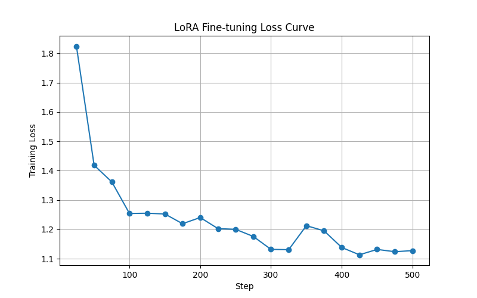
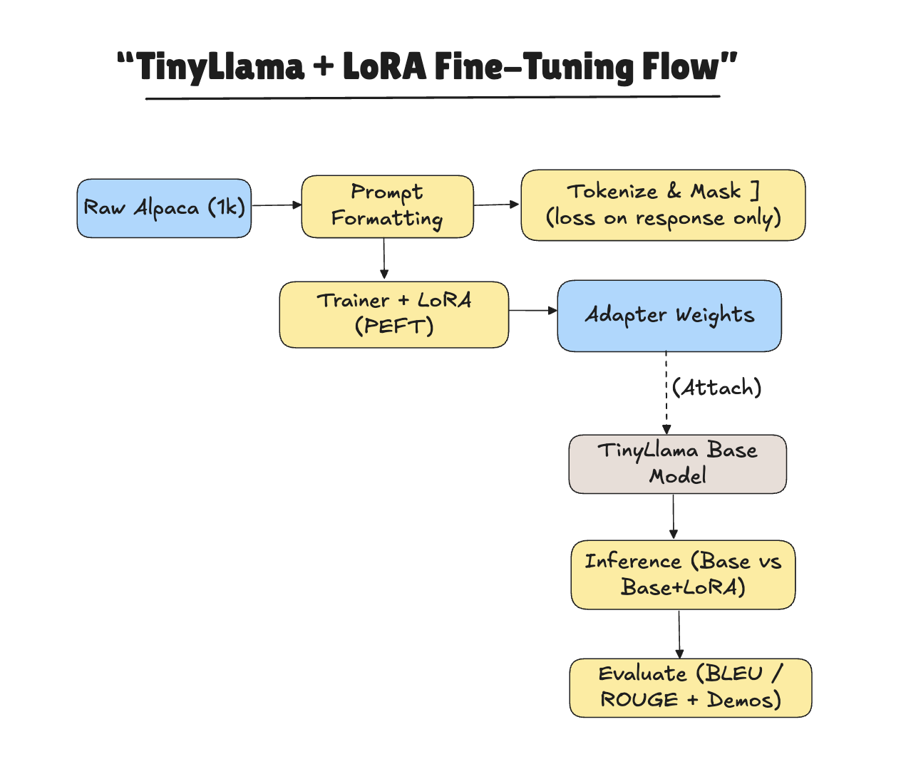

# TinyLlama (≈1.1B) + LoRA (PEFT) — Local-First Fine-Tuning Proof-of-Concept

## 🚀 TL;DR
I fine-tuned **TinyLlama-1.1B-Chat** using **LoRA (PEFT)** on a low-resource setup.  
Using just a **Mac M2 (16GB RAM)** for smoke tests and **Google Colab T4** for a longer run, I trained adapters on a **1k Alpaca subset**.  

➡️ This shows that **LLM fine-tuning is possible without expensive GPUs**.  
➡️ With LoRA, we only train ~0.2% of parameters → training becomes **light, fast, and shareable**.

---
## 🧠 Model & Method
- **Base model**: [TinyLlama/TinyLlama-1.1B-Chat-v1.0](https://huggingface.co/TinyLlama/TinyLlama-1.1B-Chat-v1.0)  
- **Method**: LoRA (via 🤗 PEFT)  
- **Dataset**: Alpaca (1,000 examples subset)  
- **Hardware**:  
  - Mac M2 16GB → smoke tests & pipeline structure  
  - Google Colab T4 → longer run (14–15GB VRAM)  
- **Artifacts**: adapter weights, evaluation CSV, loss curve, before/after examples  

---

## 💡 Why This Project?
Students and indie builders rarely have A100s. With **PEFT/LoRA**:
- Only small adapter matrices are trained (~0.2% of weights).  
- Memory + compute needs shrink drastically.  
- Adapters are lightweight → easy to share, merge, or attach to base models.  

This project demonstrates **practical fine-tuning on modest hardware**.

---
```
📂 Repo Structure:

tinyllama-lora/
│
├─ notebooks/
│   └─ tinyllama_lora_experiment.ipynb      
│
├─ outputs/
│   └─ exp1/
│       ├─ adapter/                          
│       ├─ eval_results.csv                  
│       └─ loss_curve.png                    
│
├─ docs/
│   └─ diagrams/
│       ├─ loss_curve.png             
│       └─ lora_flow.png                     
│
├─ .gitignore
└─ README.md
```
---

## 🔎 What is LoRA (PEFT)?
Instead of updating all **1.1B parameters**, LoRA injects **small rank-r adapter matrices** into attention layers (`q_proj`, `k_proj`, `v_proj`, `o_proj`).  

- During training, **only adapters get updated**.  
- Trainable params (my run): ~2.25M / 1.10B ≈ **0.20%**.  

✅ Benefits:  
- Small memory footprint  
- Faster training  
- Easy to distribute adapters instead of full models  

---

## 📊 Data
- **Source**: [tatsu-lab/alpaca](https://github.com/tatsu-lab/stanford_alpaca)  
- **Subset**: 1,000 random examples  


🔑 Loss masking: model only learns on **response tokens** (`labels = -100` for prompts).

---

## ⚙️ Training Setup
- **Base model**: TinyLlama-1.1B-Chat  
- **Precision**: fp16  
- **LoRA config**:  
  - r=8, lora_alpha=16, lora_dropout=0.05  
  - targets: ["q_proj","k_proj","v_proj","o_proj"]  

### Trainer (exp1)
- batch_size = 1  
- grad_accumulation = 8 (effective 8)  
- max_steps = 500  
- learning_rate = 2e-4  
- warmup = 50  
- fp16 = True  

---

## 🖥️ Hardware
- **Mac M2 16GB** → smoke test (to validate data pipeline + saving)  
- **Google Colab T4 (14–15GB VRAM)** → longer run (500 steps)  

Why it works: **Adapters are tiny** → backprop is limited → much lower VRAM needs.  

---

## 📈 Results & Training Loss

### Evaluation Metrics
Here’s a comparison between the **Base TinyLlama** and the **LoRA fine-tuned TinyLlama** on the 1k Alpaca subset:


| Metric  | Base   | LoRA   |
| ------- | ------ | ------ |
| BLEU    | 0.0541 | 0.0562 |
| ROUGE-1 | 0.2553 | 0.2309 |
| ROUGE-2 | 0.1033 | 0.0912 |
| ROUGE-L | 0.1975 | 0.1771 |


⚠️ Note: BLEU/ROUGE measure lexical overlap and may not fully capture instruction-following quality.  
✅ Side-by-side qualitative examples (see above) are often more insightful.

---

### Training Loss
Partial training statistics:


| Step | Epoch | Loss   | Grad Norm | Learning Rate |
|------|-------|--------|-----------|---------------|
| 25   | 0.2   | 1.8243 | 0.9568    | 0.000096      |
| 50   | 0.4   | 1.4186 | 0.9553    | 0.000196      |
| 75   | 0.6   | 1.3620 | 0.5832    | 0.000189      |
| 100  | 0.8   | 1.2543 | 1.1479    | 0.000178      |
| 125  | 1.0   | 1.2552 | 0.7734    | 0.000167      |


Below is the **visual training loss curve** for this run:



✅ Observations:
- Loss steadily decreases over training steps.
- Grad norm remains stable, indicating stable training.
- Learning rate decays as expected from the scheduler.


---

## 📝 Examples

## 📝 Before vs After (Base vs LoRA)

Here are qualitative comparisons between the **Base TinyLlama** and the **LoRA fine-tuned TinyLlama**.

---

### 🌙 Prompt: *"Write a short poem about the moon."*

**Base TinyLlama**
> The moon is bright in the night sky. It shines.

**LoRA Fine-Tuned**
> Silver lantern in the sky, guiding tides as nights go by.  
> Silent keeper, calm and true, the world still dreams because of you.

---

### ☀️ Prompt: *"Explain why the sky is blue in simple terms."*

**Base TinyLlama**
> The sky is blue because of scattering.

**LoRA Fine-Tuned**
> The sky looks blue because sunlight hits air.  
> Tiny air particles scatter blue light more than red, so our eyes see mostly blue.

---

### 📚 Prompt: *"Give 3 tips for studying effectively."*

**Base TinyLlama**
> Study. Revise. Practice.

**LoRA Fine-Tuned**
> 1. Break topics into small chunks.  
> 2. Test yourself often.  
> 3. Sleep well so your brain keeps the memory.

---

### 🌎 Prompt: *"Translate 'Good morning' to Spanish."*

**Base TinyLlama**
> Good morning.

**LoRA Fine-Tuned**
> Buenos días.

---

### 🐘 Prompt: *"Tell me a fun fact about elephants."*

**Base TinyLlama**
> Elephants are big animals.

**LoRA Fine-Tuned**
> Elephants can recognize themselves in mirrors — one of the few animals with self-awareness!

---

✅ **Takeaway**: LoRA fine-tuning makes responses **longer, structured, and more helpful** compared to the generic outputs of the base model.


---

## 📊 Diagrams

Flow of this project (from raw data → LoRA adapters → evaluation):




---

## 🙏 Acknowledgements
- [TinyLlama](https://huggingface.co/TinyLlama) team for compact 1.1B chat model  
- 🤗 [Transformers](https://github.com/huggingface/transformers), [PEFT](https://github.com/huggingface/peft), [Datasets](https://github.com/huggingface/datasets)  
- Alpaca dataset creators  

---

## 📜 License
This project is licensed under the MIT License — see the [LICENSE](LICENSE) file for details.

